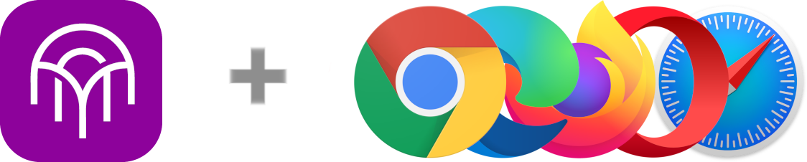

<p align="center">
  <a href="https://kibis.is">
    
  </a>
</p>

<h1 align="center">
  Kibisis Web Extension
</h1>

<p align="center">
  <a href="https://github.com/agoralabs-sh/kibisis-web-extension/releases/latest">
    
  </a>
  <a href="https://github.com/agoralabs-sh/kibisis-web-extension/releases/latest">
    
  </a>
</p>

<p align="center">
  <a href="https://github.com/agoralabs-sh/kibisis-web-extension/releases">
    
  </a>
  <a href="https://github.com/agoralabs-sh/kibisis-web-extension/releases">
    
  </a>
</p>

<p align="center">
  <a href="https://chromewebstore.google.com/detail/kibisis/hcgejekffjilpgbommjoklpneekbkajb" target="_blank">
    
  </a>

  <a href="https://microsoftedge.microsoft.com/addons/detail/kibisis/bajncpocmkioafbijldokfbjajelkbmc" target="_blank">
    
  </a>

  <a href="https://addons.mozilla.org/en-GB/firefox/addon/kibisis" target="_blank">
    
  </a>
</p>

<p align="center">
  <a href="https://github.com/agoralabs-sh/kibisis-web-extension/blob/main/LICENSE">
    
  </a>
</p>

<p align="center">
  An AVM wallet in your browser that goes beyond just DeFi.
</p>

### Table of contents

* [1. Installation](#-1-installation)
* [2. Usage](#-2-usage)
  * [2.1. Quick Start](#21-quick-start)
  * [2.2. API](#22-api)
* [3. Development](#-3-development)
  * [3.1. Requirements](#31-requirements)
  * [3.2. Setup](#32-setup)
  * [3.3. Run](#33-run)
* [4. Appendix](#-4-appendix)
  * [4.1. Useful Commands](#41-useful-commands)
  * [4.2. Manifest Permissions](#42-manifest-permissions)
* [5. How To Contribute](#-5-how-to-contribute)
* [6. License](#-6-license)

## 📦 1. Installation

Coming soon...

## 🪄 2. Usage

### 2.1 Quick Start

Coming soon...

<sup>[Back to top ^][table-of-contents]</sup>

### 2.2 API

Coming soon...

<sup>[Back to top ^][table-of-contents]</sup>

## 🛠 3. Development

### 3.1. Requirements

* Install [Yarn v1.22.5+][yarn]
* Install [jq][jq]

<sup>[Back to top ^][table-of-contents]</sup>

### 3.2. Setup

1. Install the dependencies:
```bash
$ yarn install
```

> ⚠️ **NOTE:** a couple of post install scripts will run that will download and install Chrome and Firefox browser binaries at the project root. These binaries will be used for running development versions of the extension.

2. In the newly created `.env` file, replace the environment values with the desired values.

<sup>[Back to top ^][table-of-contents]</sup>

### 3.3. Run

* To run simply use:
```bash
$ yarn start:<chrome|firefox>
```

> ⚠️ **NOTE:** this command will bundle the TypeScript source code and extension assets into the `.build/` directory and depending on your intended target (you can choose '`chrome`' or '`firefox`') the corresponding browser will start up with the unpacked extension as a temporary extension.

<sup>[Back to top ^][table-of-contents]</sup>

## 📑 4. Appendix

### 4.1. Useful Commands

| Command                | Description                                                                                                                                                                                            |
|------------------------|--------------------------------------------------------------------------------------------------------------------------------------------------------------------------------------------------------|
| `yarn build:chrome`    | Bundles the source code and Chrome specific assets into the `.chrome_build/` directory.                                                                                                                |
| `yarn build:firefox`   | Bundles the source code and Firefox specific assets into the `.firefox_build/` directory.                                                                                                              |
| `yarn install:chrome`  | Installs the latest version of Chrome For Testing browser to the project root. This removes the existing version if it exists.                                                                         |
| `yarn install:firefox` | Installs the latest version of Firefox Developer Edition browser to the project root. This removes the existing version if it exists.                                                                  |
| `yarn package:chrome`  | Packages the contents of the `.chrome_build/` directory into a `kibisis-chrome-{version}.zip` file, ready for submission.                                                                              |
| `yarn package:firefox` | Packages the contents of the `.firefox_build/` directory into a `kibisis-firefox-{version}.zip` file, ready for submission.                                                                            |
| `yarn prettier`        | Runs `prettier` with the same configuration that is run on the pre-commit hooks.                                                                                                                       |
| `yarn start:chrome`    | Bundles the source code & the add-on assets, starts the local Chrome For Testing Developer edition with the add-on installed. This will watch for changes in the source code and reload the extension. |
| `yarn start:firefox`   | Bundles the source code & the add-on assets, starts the local Firefox Developer edition with the add-on installed. This will watch for changes in the source code and reload the extension.            |
| `yarn start:dapp`      | Starts the example dApp at [http://localhost:8080](http://localhost:8080)                                                                                                                              |
<sup>[Back to top ^][table-of-contents]</sup>

### 4.2. Manifest Permissions

| Value         | Version  | Justification                                                                                                                                                                  |
|---------------|----------|--------------------------------------------------------------------------------------------------------------------------------------------------------------------------------|
| `<all_urls>`  | 2        | When the extension attempts to scan the QR code of a WalletConnect dapp, the [`tabs.captureVisibleTab()`][capture-visible-tab-api] function is used.                           |
| `activeTab`   | 3        | As above, the extension requires access to the [`tabs.captureVisibleTab()`][capture-visible-tab-api].                                                                          |
| `storage`     | 2 and 3  | The [storage][storage-api] API is used to maintain the state of the extension. It saves encrypted private keys, settings and the lists of AVM assets.                          |

<sup>[Back to top ^][table-of-contents]</sup>

## 👏 5. How To Contribute

Please read the [**Contributing Guide**][contribute] to learn about the development process.

<sup>[Back to top ^][table-of-contents]</sup>

## 📄 6. License

Please refer to the [LICENSE][license] file.

<sup>[Back to top ^][table-of-contents]</sup>

<!-- Links -->
[capture-visible-tab-api]: https://developer.mozilla.org/en-US/docs/Mozilla/Add-ons/WebExtensions/API/tabs/captureVisibleTab
[contribute]: ./CONTRIBUTING.md
[download-api]: https://developer.mozilla.org/en-US/docs/Mozilla/Add-ons/WebExtensions/API/downloads/download
[jq]: https://github.com/jqlang/jq
[license]: ./LICENSE
[storage-api]: https://developer.mozilla.org/en-US/docs/Mozilla/Add-ons/WebExtensions/API/storage
[table-of-contents]: #table-of-contents
[use-web-ext]: https://extensionworkshop.com/documentation/develop/getting-started-with-web-ext/#using-web-ext-section
[yarn]: https://yarnpkg.com/
